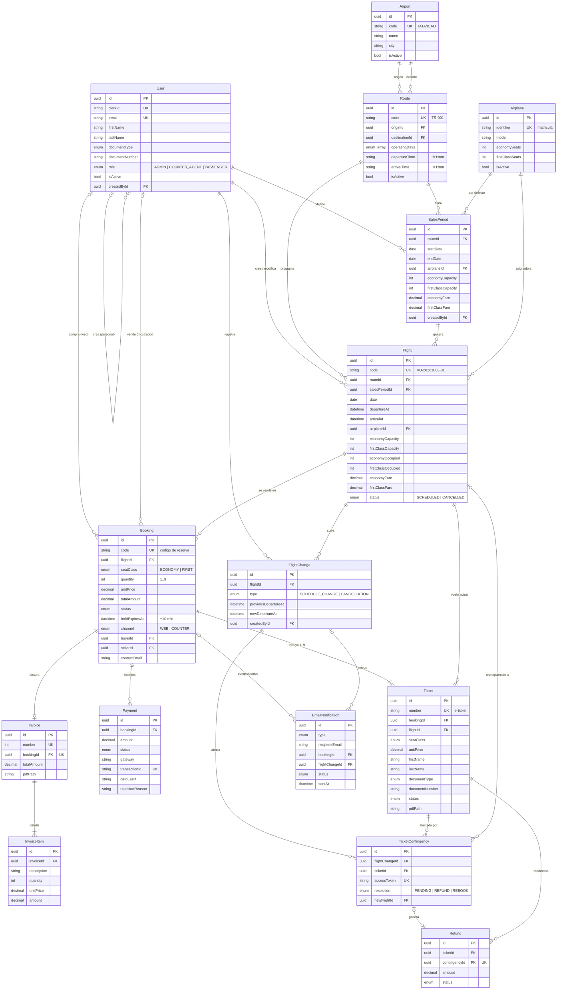

# VolAR — Modelo de Datos (Enunciado 1)

Modelo de datos del sistema de gestión de vuelos, derivado del enunciado y de las User Stories US-01 a US-36 (Sprints 1, 2 y 3). Implementado en `volar/prisma/schema.prisma` (Prisma 7 + PostgreSQL).

## Diagrama Entidad-Relación

## Entidades

| Entidad | Tabla | Descripción | User Stories |
|---|---|---|---|
| User | `users` | Cuenta de pasajero, empleado de mostrador o administrador, vinculada a Clerk por `clerkId`. Guarda el rol y los datos del negocio. Baja lógica con `isActive`. | US-28, 29, 30, 31 |
| Airport | `airports` | Catálogo de aeropuertos; código IATA/ICAO único. | US-01 |
| Airplane | `airplanes` | Flota con capacidad por clase. | US-02 |
| Route | `routes` | Trayecto: origen, destino, días de operación y horarios semanales. | US-03 |
| SalesPeriod | `sales_periods` | Período de venta de un trayecto; rango sobre el que se generan los vuelos, con avión, capacidad y tarifas por defecto. | US-04, 07 |
| Flight | `flights` | Vuelo con fecha real: avión, cupo, tarifas y estado. | US-04, 05, 06, 08, 09, 10, 11, 12, 13, 14, 27 |
| Booking | `bookings` | Compra de 1 a 9 pasajes de una misma clase, web o mostrador. | US-15, 16, 17, 21, 33, 34, 35 |
| Ticket | `tickets` | Pasaje electrónico por pasajero, con sus datos identificatorios. | US-18, 23, 26, 34, 36 |
| Payment | `payments` | Cada intento de pago contra la pasarela (aprobado o rechazado). | US-20, 21, 22 |
| Invoice / InvoiceItem | `invoices`, `invoice_items` | Factura con desglose de la compra confirmada. | US-23, 36 |
| FlightChange | `flight_changes` | Cambio de horario o cancelación de un vuelo, con valores anteriores y nuevos. | US-05, 06, 25 |
| TicketContingency | `ticket_contingencies` | Pasaje afectado por un cambio y la opción que eligió el pasajero. | US-25, 26 |
| Refund | `refunds` | Reembolso de un pasaje. | US-26 |
| EmailNotification | `email_notifications` | Registro de cada email (comprobantes y avisos) y su estado de envío. | US-24, 25 |

## Decisiones de diseño

- **Trayecto → Período → Vuelo.** Un trayecto define la programación semanal. Para cada temporada se crea un `SalesPeriod` (fechas de inicio/fin de venta, avión, capacidad y tarifas por defecto) y a partir de él se genera un `Flight` por cada fecha que coincide con `operatingDays` (US-04, US-07). `@@unique([routeId, date])` evita generar dos veces el mismo vuelo.
- **Cambios en una fecha puntual (US-05).** El vuelo guarda sus propios `departureAt`/`arrivalAt`, avión, capacidad y tarifas: modificarlos no altera el trayecto ni los demás vuelos. Guardar la partida como fecha y hora completa resuelve la llegada al día siguiente (US-03) y permite validar que un avión no quede en dos vuelos superpuestos (US-04).
- **Cupo atómico (US-10, US-17).** `economyOccupied` / `firstClassOccupied` cuentan los asientos vendidos más los retenidos por compras en `PENDING_PAYMENT`. La reserva se hace con un `UPDATE ... WHERE occupied + n <= capacity`; si no se actualiza ninguna fila, no hay cupo. Si vence `holdExpiresAt` (10 min) o se rechaza el pago, el contador se decrementa. Cupo disponible = `capacity − occupied`.
- **Precio congelado (US-12).** `Booking.unitPrice` y `Ticket.unitPrice` guardan la tarifa vigente al comprar; cambiar la tarifa del vuelo solo afecta a las compras nuevas.
- **Cancelación sin borrado (US-06).** `Flight.status = CANCELLED`. Aeropuertos, aviones, trayectos y usuarios usan baja lógica (`isActive`).
- **Venta en mostrador (US-33).** `Booking.channel = COUNTER` y `sellerId` identifica al empleado. `buyerId` es opcional porque el pasajero puede no tener cuenta; los comprobantes van a `contactEmail`.
- **Reprogramación (US-26).** `Ticket.flightId` es el vuelo actual del pasaje: al reprogramar se reasigna al nuevo vuelo y `TicketContingency.newFlightId` registra el destino del cambio.
- **Autenticación con Clerk (US-28, US-29, RNF-07, RNF-08).** El registro, el login, las sesiones y las credenciales los gestiona Clerk: la base no guarda contraseñas ni sesiones. `User.clerkId` vincula al usuario de Clerk con su fila local, que guarda el rol (US-30), los datos del pasajero y las relaciones con compras y vuelos.
- **Datos de pago (RNF-08).** De los pagos se guarda el id de transacción, la marca y los últimos 4 dígitos; nunca el número completo ni el CVV.
- **Reportes de ocupación (US-27).** No necesitan tabla propia: se calculan desde `Flight` (capacidad por clase) y `Ticket` en estado `ISSUED` (vendidos), filtrando por vuelo, clase y rango de fechas.

## Reglas que valida la aplicación

Prisma no expresa restricciones `CHECK`, así que estas reglas se validan en el backend (o con un `CHECK` agregado a mano en la migración SQL):

- Origen ≠ destino, y al menos un día de operación (US-03).
- Asientos ≥ 0 y al menos una clase con asientos (US-02, US-09); la capacidad no puede quedar por debajo de lo vendido (US-02, US-05, US-09).
- `endDate ≥ startDate` (US-07) y tarifas > 0 (US-11).
- `quantity` entre 1 y 9 (US-15).
- No dar de baja aeropuertos o aviones con vuelos futuros, ni trayectos con pasajes vendidos (US-01, US-02, US-03).

## Fuera de alcance

Las US opcionales (US-37 a US-43) no forman parte de los sprints y no están modeladas. Si se incorporan, requieren: asientos por vuelo (US-37), check-in y tarjeta de embarque (US-38), política de penalidades (US-39), equipaje como `InvoiceItem` adicional (US-41) y una tabla de auditoría genérica (US-43).
